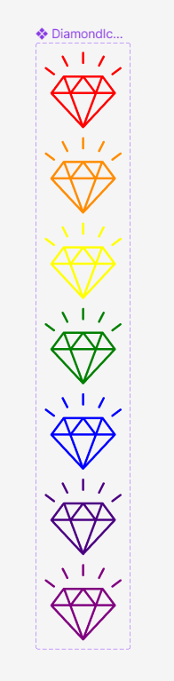
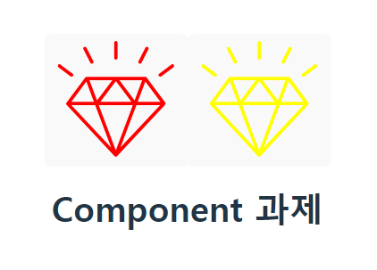

# :punch: FE School 6기 - React 과제  :punch:
 
## :fire: mission 1.
:small_blue_diamond: Figma를 사용해 아토믹(atomic) 컴포넌트를 설계(design)한 후, 리액트 컴포넌트로 구현 <br>
:link: [Figma 컴포넌트 설계](https://www.figma.com/file/2yUmCuWMsTZ7jY86jXH3cH/Homework%3A-Component?type=design&node-id=0%3A1&mode=design&t=Tn4PORD6e29JJdIM-1)

## :camera: 결과 스크린샷



## :speech_balloon: 코드리뷰
- DiamondButton 컴포넌트 사용시 color를 지정해주면 색상 변경
  (빨강, 노랑만 구현)
  ```js
    import './App.css'
    import DiamondButton from './parts/DiamondButton'


    function App() {
      return (
        <>
        <DiamondButton color="red"/>
        <DiamondButton color="yellow"/>
        <h1>Component 과제</h1>
        </>
      )
    }

    export default App
  ```
  ```js
  function DiamondButton({color}) {
  return (
    <button type="button">
    <svg> ... </svg>
    </button>
  ); 
  }

  export default DiamondButton
  ```